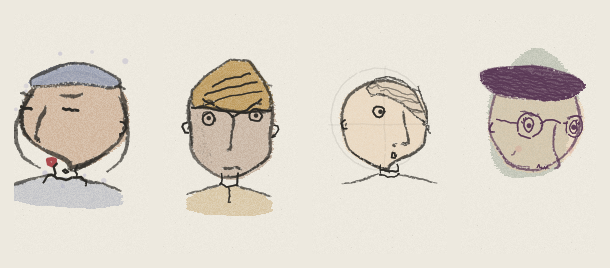
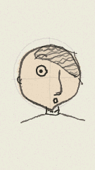

# doodlesoul

**Try it now, nothing to install:**
[evandroguedes.github.io/doodlesoul](https://evandroguedes.github.io/doodlesoul/)
— meet your chip's soul and flash the firmware straight from Chrome.

Every chip ships with a soul. Flash this, and it wakes.

**doodlesoul** wakes the one unique hand-drawn character that was always
latent in your M5StickC Plus — a little doodle person with a name, a
face, traits, a rarity tier, and moods, derived from the chip's
factory-burned MAC address. No button to skip to the next one. This one
is yours, and it is the *device's*: reflash, update, fix bugs — the same
soul greets you every time.



*Four of the 4,294,967,296 possible souls: Matone, Lugo, Posime, and
Tagugu. One of them — or more likely, someone nobody has ever seen —
will be born in your stick.*



Faces are 100% procedural (no image assets), drawn by
[doodleink](https://github.com/evandroguedes/doodleink): seeded trait
casting with rarities, a rough 3D head for pose, and a wobbly ink renderer
on paper texture. Redrawn ~12× a second with re-wobbled strokes — proper
boiling-line animation, like a sketchbook come alive.

## How the soul works

- Every ESP32 leaves the factory with a unique MAC burned into eFuse.
  doodlesoul mixes all 48 bits through splitmix64 and uses the result as
  the character seed: the soul *is* the device.
- Flashing doesn't create it and can't destroy it. The first boot just
  meets it (with a little birth announcement); every boot after that is a
  reunion. Firmware updates are safe.
- Two people flashing the same downloaded binary get different souls,
  guaranteed by the hardware.
- There is no command to change it. No reroll, no reincarnation, no
  escape hatch. If you want a different character, you need a different
  chip. That is the point.

Souls have pronounceable names (Pomu, Tavik, Belora...), derived from the
seed, and a rarity tier from common to legendary based on how improbable
their trait roll was.

## Living with it

- **tilt** — it turns to follow gravity, like a level
- **BtnA** (front) — pet it: it beams and does a little hop
- **shake** — it gets dizzy (careful)
- **BtnB click** — its soul card: name, traits, rarity, id, boot count
- **BtnB hold** — freeze on a fine-art still
- **left alone** — it daydreams: glancing around, blinking, changing mood
- **untouched 2 min** — screen dims; **6 min** — it falls asleep ("z z z",
  display off). Move it or press a button to wake it. On USB power it
  never dims.

## The web page (no install, no display needed)

**[evandroguedes.github.io/doodlesoul](https://evandroguedes.github.io/doodlesoul/)** —
open it in Chrome or Edge:

- **connect stick & meet its soul** reads your chip's MAC over Web Serial
  and renders the exact character that lives (or would live) in it — drawn
  in the browser by the same engine, compiled to WebAssembly from the same
  source. Works on display-less boards too.
- **install doodlesoul firmware** flashes the stick right from the page
  (esptool-js), no toolchain needed.
- Or type any MAC address and meet its soul.

Because the browser and the firmware share `soul.h` verbatim, the page
doubles as a soft provenance check: connect any device and compare the
face on its screen with what its silicon says it should be. (It proves
the face belongs to the MAC — not that the firmware is unmodified; that
would need secure boot.)

## Build & flash

```sh
pio run -e m5stick-c-plus -t upload
pio device monitor     # the soul card prints at boot
```

Serial console: `s` dumps a pixel-perfect screenshot (decode with
doodleink's `extras/tools/screenshot.py`), `i` prints accelerometer
samples.

If tilt feels inverted on your unit, flip `YAW_SIGN` / `PITCH_SIGN` at
the top of `src/main.cpp`.

## Ports

The engine is display-agnostic; "and friends" means any ESP32 + display.
See doodleink's README for the two-method canvas interface — this whole
app is one file.

## Credits

Built on [doodleink](https://github.com/evandroguedes/doodleink).
Inspired by [Mannay](https://x.com/mannay)'s crowd doodles and
[cyber-crowd](https://github.com/kengocodes/cyber-crowd) (MIT). Power
management patterns hardened on a much-loved kids' toy project on the
same board.

MIT.
